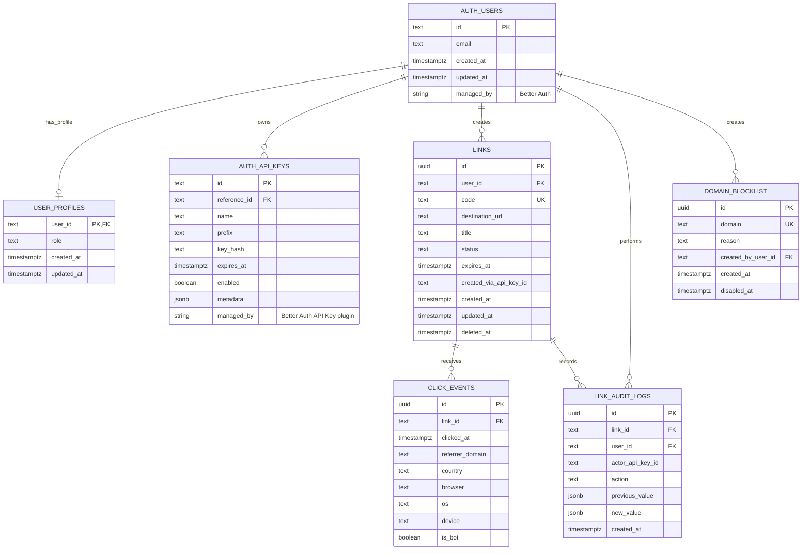

# skrol Comprehensive ERD

## 1. Updated ERD Position

skrol uses **Better Auth** for authentication. If the project also uses Better Auth's **API Key plugin**, then API key persistence should also be treated as Better Auth/plugin-managed.

That changes the ERD boundary:

```text
Better Auth generated / plugin-managed schema
    ├── users
    ├── sessions
    ├── accounts / credentials, depending on enabled auth methods
    ├── verification records, if enabled
    └── api key records, if Better Auth API Key plugin is enabled

skrol-owned schema
    ├── user_profiles
    ├── links
    ├── click_events
    ├── link_audit_logs
    └── domain_blocklist, optional
```

The important adjustment is this:

```text
Do not create a separate skrol-owned api_keys table if Better Auth API Key plugin is responsible for API key creation, listing, verification, updating, deletion, expiration, rate limiting, and metadata.
```

Instead, model API keys as an external/generated auth dependency.

---

## 2. Entity Ownership Boundary

## 2.1 Better Auth / Plugin-Managed Entities

These are not core skrol product tables. They are generated or managed by Better Auth and its enabled plugins.

```text
AUTH_USERS
AUTH_SESSIONS
AUTH_ACCOUNTS
AUTH_VERIFICATIONS
AUTH_API_KEYS
```

The exact physical table names should follow the Better Auth generated migration/schema. Do not hard-code speculative table names in skrol migrations before checking the generated schema.

## 2.2 skrol-Owned Entities

These are the tables skrol should define directly:

```text
user_profiles
links
click_events
link_audit_logs
domain_blocklist -- optional
```

---

skrol-owned tables should use PostgreSQL 18 `uuidv7()` defaults for primary keys.

## 3. Recommended Comprehensive Mermaid ERD



---

## 4. Key ERD Changes From the Previous Version

## 4.1 Remove skrol-owned `api_keys`

Previous model:

```text
api_keys -- skrol-owned table
```

Recommended model if Better Auth API Key plugin is used:

```text
AUTH_API_KEYS -- Better Auth plugin-managed table
```

This prevents duplicated key lifecycle logic.

## 4.2 Add Optional Logical References to API Keys

You do not need to store API keys in skrol tables, but you may want to record which API key performed a product action.

Recommended optional fields:

```text
links.created_via_api_key_id NULL
link_audit_logs.actor_api_key_id NULL
```

These should be treated as logical references to the Better Auth API Key plugin's key ID.

Whether you enforce database-level foreign keys depends on whether Better Auth's generated API key table and ID type are stable and accessible in your migration setup.

## 4.3 Keep User Ownership on skrol Tables

Even if a link is created through an API key, the link should still belong to a user.

Keep:

```text
links.user_id
```

Do not replace it with only:

```text
links.api_key_id
```

The API key is an authentication credential. The user is the durable resource owner.

---

## 5. Entity Details

## 5.1 `AUTH_USERS`

### Ownership

Better Auth managed.

### Purpose

Stores user identity records.

### ERD Treatment

Represent this table as an external/generated dependency.

### Expected Logical Fields

```text
id
email
created_at
updated_at
```

The actual generated schema may include additional columns.

---

## 5.2 `AUTH_API_KEYS`

### Ownership

Better Auth API Key plugin managed.

### Purpose

Stores API key records used to authenticate API requests.

### ERD Treatment

Represent this as a plugin-managed dependency, not as a skrol-owned table.

### Expected Logical Fields

The exact table shape should come from Better Auth's generated migration. Conceptually, expect fields for:

```text
id
reference_id / owner id
name
prefix
hashed key material
enabled / revoked state
expiration
rate-limit settings
remaining request count / refill settings
metadata
created_at
updated_at
```

### Notes

- The owner field may be modeled as a generic reference ID because Better Auth API keys can be user-owned or organization-owned depending on plugin configuration.
- For skrol MVP, configure user-owned API keys.
- Keep organization-owned API keys out of MVP unless the product later adds organizations.

---

## 5.3 `user_profiles`

### Ownership

skrol owned.

### Purpose

Stores skrol-specific metadata for users, especially authorization role.

### Columns

| Column       |        Type | Required | Notes                                        |
| ------------ | ----------: | -------: | -------------------------------------------- |
| `user_id`    |        text |      yes | Primary key. References Better Auth user ID. |
| `role`       |        text |      yes | `user` or `admin`.                           |
| `created_at` | timestamptz |      yes | Profile creation time.                       |
| `updated_at` | timestamptz |      yes | Last profile update time.                    |

### Relationship

```text
AUTH_USERS 1 ─── 0..1 user_profiles
```

### Constraint

```sql
CHECK (role IN ('user', 'admin'))
```

---

## 5.4 `links`

### Ownership

skrol owned.

### Purpose

Stores short-link records. This is the central product entity.

### Columns

| Column                   |        Type | Required | Notes                                                 |
| ------------------------ | ----------: | -------: | ----------------------------------------------------- |
| `id`                     |        uuid |      yes | Primary key, default `uuidv7()`.                      |
| `user_id`                |        text |      yes | Durable owner. References Better Auth user ID.        |
| `code`                   |        text |      yes | Public short code. Unique. Lowercase.                 |
| `destination_url`        |        text |      yes | Validated HTTP/HTTPS destination.                     |
| `title`                  |        text |       no | Optional display title.                               |
| `status`                 |        text |      yes | `active`, `disabled`, `flagged`, or `deleted`.        |
| `expires_at`             | timestamptz |       no | Null means no expiration.                             |
| `created_via_api_key_id` |        text |       no | Optional logical reference to Better Auth API key ID. |
| `created_at`             | timestamptz |      yes | Creation timestamp.                                   |
| `updated_at`             | timestamptz |      yes | Last update timestamp.                                |
| `deleted_at`             | timestamptz |       no | Soft-delete timestamp.                                |

### Relationships

```text
AUTH_USERS 1 ─── many links
AUTH_API_KEYS 1 ─── many links, optional logical relationship
links 1 ─── many click_events
links 1 ─── many link_audit_logs
```

### Constraints

```sql
UNIQUE (code)
```

```sql
CHECK (code = lower(code))
```

```sql
CHECK (status IN ('active', 'disabled', 'flagged', 'deleted'))
```

### Required Indexes

```sql
CREATE UNIQUE INDEX links_code_unique_idx ON links(code);
CREATE INDEX links_user_id_idx ON links(user_id);
CREATE INDEX links_user_id_created_at_idx ON links(user_id, created_at DESC);
```

Optional if you store `created_via_api_key_id`:

```sql
CREATE INDEX links_created_via_api_key_id_idx ON links(created_via_api_key_id);
```

### Business Rules

- `code` must be globally unique.
- Custom aliases are case-insensitive and stored lowercase.
- Generated codes should use lowercase `a-z` and digits `0-9`.
- Deleted links are soft-deleted.
- Disabled, flagged, expired, and deleted links must not redirect.
- Expiration is computed from `expires_at`; a separate `expired` status is unnecessary.

---

## 5.5 `click_events`

### Ownership

skrol owned.

### Purpose

Stores privacy-conscious analytics events generated by successful redirects.

### Columns

| Column            |        Type | Required | Notes                                               |
| ----------------- | ----------: | -------: | --------------------------------------------------- |
| `id`              |        text |      yes | Primary key, for example `clk_...`.                 |
| `link_id`         |        text |      yes | Link that received the click.                       |
| `clicked_at`      | timestamptz |      yes | Event timestamp.                                    |
| `referrer_domain` |        text |       no | Normalized referrer domain only.                    |
| `country`         |        text |       no | ISO country code if geolocation is implemented.     |
| `browser`         |        text |       no | Browser family only.                                |
| `os`              |        text |       no | Operating system family only.                       |
| `device`          |        text |       no | `desktop`, `mobile`, `tablet`, `bot`, or `unknown`. |
| `is_bot`          |     boolean |      yes | Bot classification.                                 |

### Relationship

```text
links 1 ─── many click_events
```

### Required Indexes

```sql
CREATE INDEX click_events_link_id_idx ON click_events(link_id);
CREATE INDEX click_events_clicked_at_idx ON click_events(clicked_at);
CREATE INDEX click_events_link_id_clicked_at_idx ON click_events(link_id, clicked_at DESC);
```

### Forbidden Long-Term Fields

```text
raw_ip
full_user_agent
cookie_id
visitor_id
fingerprint_id
session_id
```

---

## 5.6 `link_audit_logs`

### Ownership

skrol owned.

### Purpose

Stores an audit trail for important link lifecycle changes.

### Columns

| Column             |        Type | Required | Notes                                                 |
| ------------------ | ----------: | -------: | ----------------------------------------------------- |
| `id`               |        text |      yes | Primary key, for example `aud_...`.                   |
| `link_id`          |        text |      yes | Link being modified.                                  |
| `user_id`          |        text |       no | User/admin actor if known.                            |
| `actor_api_key_id` |        text |       no | Optional logical reference to Better Auth API key ID. |
| `action`           |        text |      yes | Audited action name.                                  |
| `previous_value`   |       jsonb |       no | Previous value snapshot.                              |
| `new_value`        |       jsonb |       no | New value snapshot.                                   |
| `created_at`       | timestamptz |      yes | Audit timestamp.                                      |

### Relationships

```text
links 1 ─── many link_audit_logs
AUTH_USERS 1 ─── many link_audit_logs
AUTH_API_KEYS 1 ─── many link_audit_logs, optional logical relationship
```

### Required Indexes

```sql
CREATE INDEX link_audit_logs_link_id_idx ON link_audit_logs(link_id);
CREATE INDEX link_audit_logs_user_id_idx ON link_audit_logs(user_id);
CREATE INDEX link_audit_logs_created_at_idx ON link_audit_logs(created_at DESC);
```

Optional:

```sql
CREATE INDEX link_audit_logs_actor_api_key_id_idx ON link_audit_logs(actor_api_key_id);
```

### Recommended Action Values

```text
destination_url_changed
link_disabled
link_reenabled
link_deleted
link_flagged
link_unflagged
expiration_changed
title_changed
```

---

## 5.7 `domain_blocklist`

### Ownership

skrol owned, optional.

### Purpose

Stores domains that cannot be used as link destinations.

### Columns

| Column               |        Type | Required | Notes                               |
| -------------------- | ----------: | -------: | ----------------------------------- |
| `id`                 |        text |      yes | Primary key, for example `blk_...`. |
| `domain`             |        text |      yes | Normalized domain. Unique.          |
| `reason`             |        text |       no | Internal block reason.              |
| `created_by_user_id` |        text |       no | Admin actor if known.               |
| `created_at`         | timestamptz |      yes | Creation timestamp.                 |
| `disabled_at`        | timestamptz |       no | Null means active blocklist entry.  |

### Relationship

```text
AUTH_USERS 1 ─── many domain_blocklist entries
```

### Indexes

```sql
CREATE UNIQUE INDEX domain_blocklist_domain_idx ON domain_blocklist(domain);
CREATE INDEX domain_blocklist_active_idx
  ON domain_blocklist(domain)
  WHERE disabled_at IS NULL;
```

---

## 6. Revised PostgreSQL DDL Draft for skrol-Owned Tables Only

This DDL intentionally excludes Better Auth generated tables and Better Auth API Key plugin tables.

Assumption used below:

```text
Better Auth user table = auth_users
Better Auth user primary key = auth_users.id
```

Replace `auth_users` with the actual generated table name.

```sql
CREATE TABLE user_profiles (
  user_id text PRIMARY KEY REFERENCES auth_users(id) ON DELETE CASCADE,
  role text NOT NULL DEFAULT 'user',
  created_at timestamptz NOT NULL DEFAULT now(),
  updated_at timestamptz NOT NULL DEFAULT now(),

  CONSTRAINT user_profiles_role_check
    CHECK (role IN ('user', 'admin'))
);
```

```sql
CREATE TABLE links (
  id text PRIMARY KEY,
  user_id text NOT NULL REFERENCES auth_users(id) ON DELETE CASCADE,
  code text NOT NULL,
  destination_url text NOT NULL,
  title text,
  status text NOT NULL DEFAULT 'active',
  expires_at timestamptz,
  created_via_api_key_id text,
  created_at timestamptz NOT NULL DEFAULT now(),
  updated_at timestamptz NOT NULL DEFAULT now(),
  deleted_at timestamptz,

  CONSTRAINT links_code_unique UNIQUE (code),
  CONSTRAINT links_code_lowercase_check CHECK (code = lower(code)),
  CONSTRAINT links_status_check
    CHECK (status IN ('active', 'disabled', 'flagged', 'deleted'))
);

CREATE UNIQUE INDEX links_code_unique_idx ON links(code);
CREATE INDEX links_user_id_idx ON links(user_id);
CREATE INDEX links_user_id_created_at_idx ON links(user_id, created_at DESC);
CREATE INDEX links_created_via_api_key_id_idx ON links(created_via_api_key_id);
```

```sql
CREATE TABLE click_events (
  id text PRIMARY KEY,
  link_id text NOT NULL REFERENCES links(id) ON DELETE CASCADE,
  clicked_at timestamptz NOT NULL DEFAULT now(),
  referrer_domain text,
  country text,
  browser text,
  os text,
  device text,
  is_bot boolean NOT NULL DEFAULT false,

  CONSTRAINT click_events_device_check
    CHECK (device IS NULL OR device IN ('desktop', 'mobile', 'tablet', 'bot', 'unknown'))
);

CREATE INDEX click_events_link_id_idx ON click_events(link_id);
CREATE INDEX click_events_clicked_at_idx ON click_events(clicked_at);
CREATE INDEX click_events_link_id_clicked_at_idx ON click_events(link_id, clicked_at DESC);
```

```sql
CREATE TABLE link_audit_logs (
  id text PRIMARY KEY,
  link_id text NOT NULL REFERENCES links(id) ON DELETE CASCADE,
  user_id text REFERENCES auth_users(id) ON DELETE SET NULL,
  actor_api_key_id text,
  action text NOT NULL,
  previous_value jsonb,
  new_value jsonb,
  created_at timestamptz NOT NULL DEFAULT now(),

  CONSTRAINT link_audit_logs_action_check
    CHECK (action IN (
      'destination_url_changed',
      'link_disabled',
      'link_reenabled',
      'link_deleted',
      'link_flagged',
      'link_unflagged',
      'expiration_changed',
      'title_changed'
    ))
);

CREATE INDEX link_audit_logs_link_id_idx ON link_audit_logs(link_id);
CREATE INDEX link_audit_logs_user_id_idx ON link_audit_logs(user_id);
CREATE INDEX link_audit_logs_actor_api_key_id_idx ON link_audit_logs(actor_api_key_id);
CREATE INDEX link_audit_logs_created_at_idx ON link_audit_logs(created_at DESC);
```

```sql
CREATE TABLE domain_blocklist (
  id text PRIMARY KEY,
  domain text NOT NULL,
  reason text,
  created_by_user_id text REFERENCES auth_users(id) ON DELETE SET NULL,
  created_at timestamptz NOT NULL DEFAULT now(),
  disabled_at timestamptz,

  CONSTRAINT domain_blocklist_domain_unique UNIQUE (domain),
  CONSTRAINT domain_blocklist_domain_lowercase_check CHECK (domain = lower(domain))
);

CREATE UNIQUE INDEX domain_blocklist_domain_idx ON domain_blocklist(domain);
CREATE INDEX domain_blocklist_active_idx
  ON domain_blocklist(domain)
  WHERE disabled_at IS NULL;
```

---

## 7. Better Auth API Key Plugin Integration Notes

## 7.1 Recommended MVP Configuration

For skrol MVP, configure Better Auth API Key plugin for user-owned API keys.

Conceptually:

```text
API key owner = user
organization-owned keys = disabled / unused for MVP
custom prefix = skrol-compatible prefix if needed
metadata = optional
rate limiting = enabled only if compatible with skrol's broader rate-limit strategy
```

## 7.2 API Key Prefix

The PRD suggested a format like:

```text
sk_live_XXXXXXX
```

If the Better Auth API Key plugin supports a custom prefix in the desired form, use the plugin configuration rather than a custom skrol table.

## 7.3 Rate Limiting Caution

Better Auth API Key plugin can apply rate limiting during API key validation. skrol also has endpoint-level Redis rate limits.

Avoid accidentally double-counting or applying conflicting limits.

Recommended split:

```text
Better Auth API Key plugin:
    credential validity
    key ownership
    key expiration
    optional per-key limits

skrol application:
    endpoint-specific product limits
    public redirect limits
    login/link-creation abuse rules
```

## 7.4 When to Keep a Custom `api_keys` Table Anyway

Only keep a skrol-owned `api_keys` table if at least one of these is true:

```text
Better Auth API Key plugin cannot support the required key format.
Better Auth API Key plugin cannot support the required storage/security posture.
You need database-level relationships that cannot be modeled cleanly against the plugin table.
You intentionally want full ownership of API key lifecycle logic.
```

Otherwise, use Better Auth's plugin.

---

## 8. Final Recommended MVP ERD

```text
Better Auth / plugin-managed:
    AUTH_USERS
    AUTH_SESSIONS
    AUTH_ACCOUNTS
    AUTH_VERIFICATIONS
    AUTH_API_KEYS

skrol-owned:
    user_profiles
    links
    click_events
    link_audit_logs
    domain_blocklist, optional
```

The most important design rule is:

```text
Authentication and API-key lifecycle belong to Better Auth.
Short-link product data belongs to skrol.
```

That keeps the schema smaller, avoids duplicate API-key logic, and preserves a clean separation between authentication infrastructure and product persistence.
